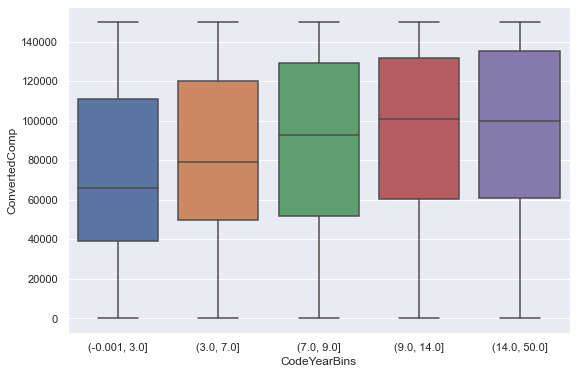

# stackoverflow-survey-data-analysis 

## Description: 
In this repo I handle missing data and perform data wrangling, cleaning and tidying techniques for a stack overflow survey and then analyse it

## How to use: 
Simply open the notebook file

## Technologies: 
- python: main language
- jupyter notebooks: main computing platform
- pandas and numpy: for exploratory data analysis (EDA)
- scikit-learn: machine learning library 
- seaborn and matplotlib: for plotting graphs

## Collaborators: 
None

## License: 
None
